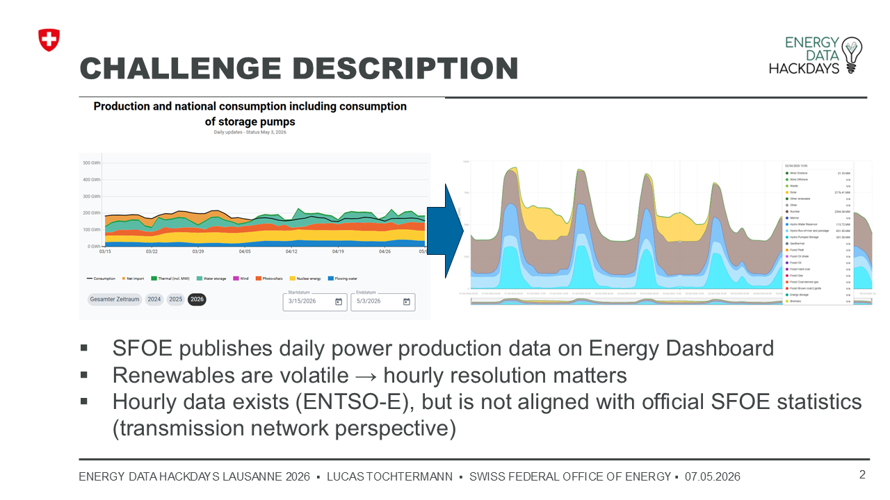
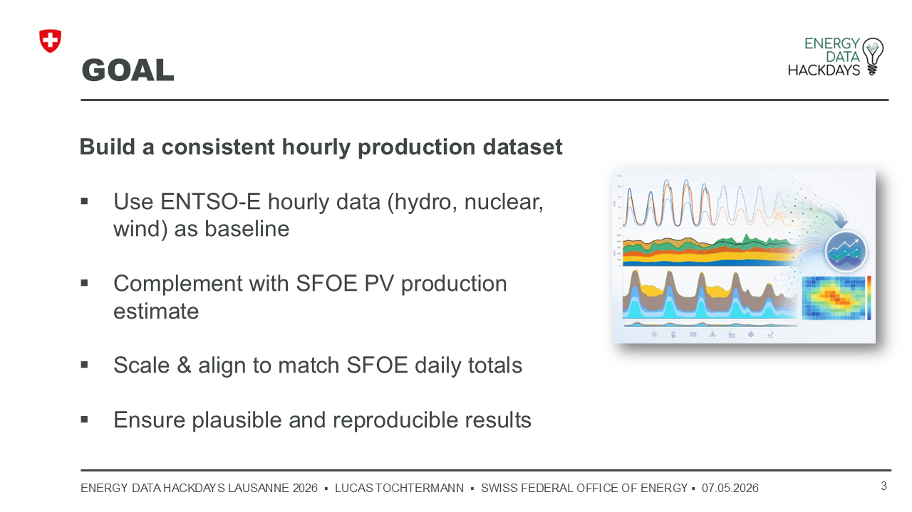
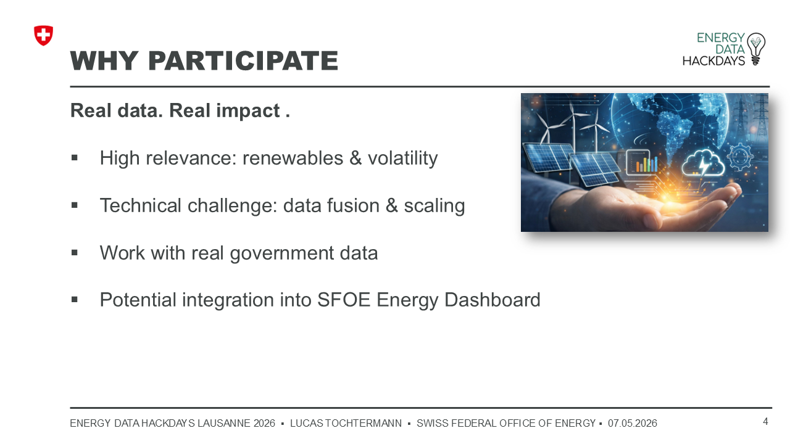

# Energy Data Hackdays 2026 Lausanne: Estimating hourly power production

SFOE Challenge for the Energy Data Hackdays 2026 Lausanne. 

### Challenge Pitch Presentation 

### Additional Data Sources:
- PV Production csv:     www.bfe-ogd.ch/backcast_data_export.csv
- PV Production parquet: www.bfe-ogdch/backcast_data_export.pq
- [ENTSOE](https://transparency.entsoe.eu/) & https://github.com/EnergieID/entsoe-py

### Compute & storage on Renku:
- https://renkulab.io/p/lucs/energy-data-hackdays-lausanne-2026
